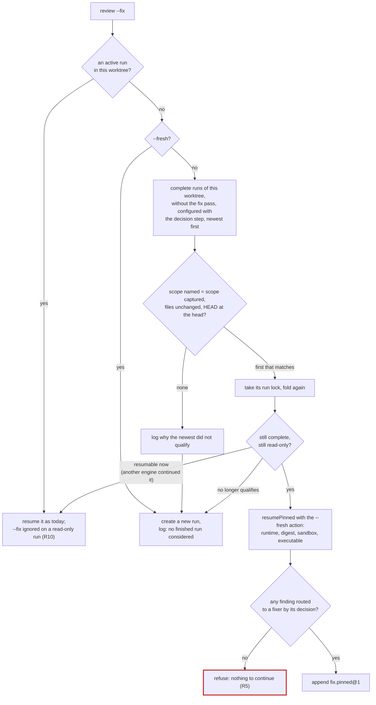
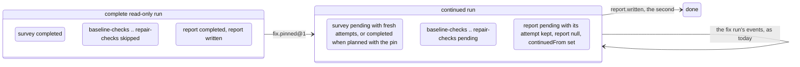
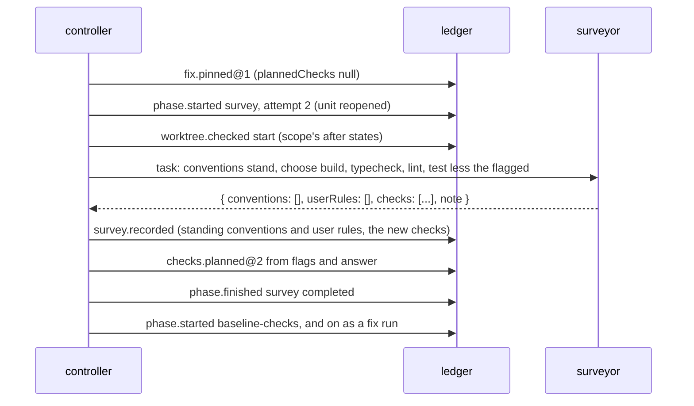

# Technical Design: Fix pass continuation

Product part: [2026-10-10-fix-pass-continuation.requirements.md](2026-10-10-fix-pass-continuation.requirements.md).

## Summary

One new event, `fix.pinned@1`, appended to a complete read-only run,
turns it into a fix run in the fold: the configuration reads as a fix
run's, the five fix phases go from skipped to pending, the report phase
opens again, the first report is kept beside the state, and, when a
surveyor is needed for the checks, the survey phase opens again with
fresh attempts for its one unit. Everything after that is the planner
and controller the fix pass already has: `nextStep` finds the survey or
the baseline checks pending, the survey step plans the checks from the
flags and the surveyor's answer, and the run goes through fixes, checks,
repair and report as every fix run does. The controller gains the
choice of the run, made in `openRun` from the scope flags and the
tree, and the refusals of R3 and R5; the surveyor's task and structural
check gain a variant that asks for the checks alone; the report, `status`
and the skills gain a line each. No phase, blocker code or vocabulary
changes, so no phase-carrying event needs a new version; the registry
gains one kind, which is one new golden fixture.

## Non-Goals

- No change to `review.configured` and no new version of it: the
  configuration is recorded once and is immutable, and the continuation
  is a later fact (TD1).
- No change to `checks.planned`, `survey.recorded`, `fixes.planned`,
  `report.written` or any phase-carrying kind; their reducers gain
  guards and read the continued state, their schemas are untouched.
- No refactor of `openRun` and `resumePinned` beyond what the
  continuation needs: the resume path stays the resume path, and the
  continuation reuses its pinned checks through one parameter for the
  action text (TD6).
- No new scope mode and no change to `captureScope`'s recording; the
  comparison the continuation needs is extracted from it, not added
  beside it (TD4).
- No change to the surveyor's role prompt fragments. The brief already
  says the checks are asked "in a run that fixes", and a continued run
  is one; the continuation's instruction is task text (TD5).

## Context

Verified at `3d38c1c` on `main`, with no uncommitted change.

- `openRun` in `src/review/controller.ts` finds the one active run
  through `findActiveRun`, whose candidates are the readable runs that
  `isResumable` admits: status `active` and no report. Under the run's
  lock it folds again (`refoldUnderLock`), refuses a run of another
  worktree or runtime, runs `resumePinned` on a configured run, and
  otherwise resolves the policy into a configuration whose `fix` is
  whether `--fix` was given, with `checks` and `fixes` present exactly
  then (`reviewConfiguredV2` in `src/checkpoint/events.ts`). The
  controller appends `review.configured@5` once and never again.
- `configure` in `src/checkpoint/review-fold.ts` marks the five fix
  phases `skipped` for a run without the fix pass and sets `fix` to
  null; `phaseStarted` refuses to start a skipped or a completed phase;
  `reportWritten` refuses a second report; `limitsChanged` refuses a
  change after the report. `reviewStatus` in `src/review/state.ts`
  calls a run with a report `complete`.
- `resumePinned` logs `--fix` as ignored on a run pinned without the
  fix pass, holds the runtime, roles digest, sandbox and executable, and
  keeps the check flags live until `checks.planned` is on the ledger
  (TD6 of the repository survey).
- `surveyStep` in `src/review/steps.ts` plans a fix run's checks from
  `resolveChecks(answer, flags)` once the last survey answer and the
  flags settle every kind, launches the surveyor otherwise, and treats
  a survey that answered with `checks: null` as covering no kind. A
  read-only run's surveyor is told not to choose checks
  (`kindsToChooseLine` in `src/review/tasks.ts`) and
  `checkSurveyAnswer` in `src/review/survey.ts` refuses checks from it;
  `surveyRecorded` in `src/checkpoint/survey-fold.ts` requires checks
  exactly when the run fixes, and `requireOpenSurvey` requires the
  survey phase running and its unit unanswered in the attempt.
  `phaseStarted` already reopens the survey unit on an attempt above one
  while the checks are unplanned.
- `fixPlanOf` routes the ranked findings by `review.decisions` with the
  pinned batch size; `routeOfDecision` in `src/checkpoint/fix-state.ts`
  sends `fix`, and `ask` whose applied option edits, to a fixer.
- `compareWorktree` in `src/scope/compare.ts` compares the tree with a
  captured scope's after states and `HEAD` with its head; `captureScope`
  in `src/scope/capture.ts` resolves a `ScopeRequest` to its mode, base,
  head and files and freezes them in one function.
- `whyNotCommittable` in `src/review/commit.ts` needs an active run with
  fix state, a report, revisions and no commits yet.
- The skill texts under `skill/claude/skills/deep-review/SKILL.md` and
  `skill/codex/SKILL.md` pass `--fix` on request and say nothing of a
  finished run.

The costs the requirements cite, 10 to 55 USD per run on this
repository, come from the gate and dogfood runs recorded in the
Verification sections under `docs/changes/`.

## Design

### Command line (R2, R3, R10)

```
deep-review review ... --fix [--fresh] [--check <kind>=<command>]... [--no-check <kind>]...
```

- `--fresh` is a boolean of `review`, refused without `--fix` by
  the flag reader beside `fixRequestOf` in `src/cli.ts`, with the usage error
  `--fresh applies only with --fix`. It is passed to the controller
  beside `fix` as `fresh: boolean`.
- Nothing else on the command line changes. The usage text names
  `--fresh` on the `--fix` line.

### Choosing the run (R1, R2, R3, R5)

`openRun` keeps its order: the active run is found and resumed first,
whatever the flags. The continuation is tried only when no active run
is found, `--fix` is given and `--fresh` is not:



- The candidates come from `readableRuns`, in ledger order, filtered to
  `reviewStatus === 'complete'`, `review.fix === null`,
  `phases.decision.status !== 'skipped'` and `sameDirectory(run.worktree,
  context.worktree)`, newest last; the newest is tried first.
- The match is `scopeMatches(request, scope, worktree, changedSince)`
  in `src/scope/compare.ts`: the request resolved as `captureScope`
  resolves it (TD4) gives the same `mode` and `base` and the same set
  of paths as the captured scope, `changedSince` finds no file of the
  scope changed, and `HEAD` is at the scope's head. The controller
  passes as `changedSince` the worktree check's own comparison,
  `findDrift` with the run's git content match, so the files are
  compared as git would store them. It returns the first reason it
  fails, in that order, as one sentence: `its scope is <mode>
  <base>..<head>, not the one named`, `its files are not the change
  named: <paths> changed since and not in it; <paths> in it and no
  longer changed`, `<n> of its files changed since: <paths>`, `HEAD is
  <sha>, not <head>`. The head is compared last, not with the mode and
  base: the request resolves its head to `HEAD`, so a head compared
  first would leave the last reason unreachable. A run configured
  before the decision step is not a candidate and is named with that
  reason when it is the newest finished read-only run of the worktree.
- When none matches: `log('--fix: no finished read-only run of this
  worktree reviewed this change as it is; a new run is created')`, then
  `run <id>: not continued: <reason>` for the newest complete run of
  the worktree configured without the fix pass, continued since or not,
  when there is one: a continued run with `it was continued into the
  fix pass already` (R8), a run configured before the decision step
  with `it was configured before the decision step, which a fix run
  routes its findings by`, any other with its `scopeMatches` reason.
  With `--fresh`: `--fresh: no finished run is considered; a new run
  is created`; with `--fresh` and an active run, which is resumed,
  `run <id> is active and resumes; --fresh is ignored`.
- The lock and the second fold follow the resume path: another engine
  may have continued the run between the find and the lock, in which
  case it is resumable now and in this worktree, and `openRun` resumes
  it rather than creating a second active run; a run that no longer
  qualifies for any other reason (abandoned, or continued and finished
  by another engine, each named with `run <id>: <which> before its lock
  was taken; a new run is created`, or holding an event this engine
  does not know, passed over with its line) releases the lock and a new
  run is created.
- `resumePinned(run, pinned, context, 'continue')` runs the pinned
  checks of R3 (TD6), after the runtime is held to the pinned one with
  `--fresh` as the way out. The decision-step guard inside it cannot
  fire, since a candidate was configured with the step.
- `fixPlanOf` needs the batch size the run has not pinned yet, and the
  batch size changes no route, so the routing alone is computed: each
  recorded decision's `routeOfDecision`, the one rule `planFixes`
  routes by. The continuation is refused when none is `fixer`:
  `run <id> has no finding to fix: <n> decided fix, <m> left, <k> asked
  with the code kept; nothing to continue; start a new run with --fresh
  to review it again`, with `its review ranked no finding` in place of
  the counts for an empty ranking, a `ReviewRefusedError` (exit 2).
  Nothing is appended.
- `openRun` returns, in place of `configure`, a `continuation:
  { pin: FixPinned, report: string } | null`; the controller appends the
  pin where it appends the configuration today, before `recordLimits`,
  which the fold accepts again once the report is cleared, and logs
  `run <id>: continued into the fix pass; its read-only report is
  <path>; spent <x> USD of the <y> USD run budget` (or `no run budget`,
  or `no cost reported`).

### The pin event and the fold (R6)

`fix.pinned@1` in `src/checkpoint/events.ts`:

- payload `{ checks: { timeoutMs }, fixes: { batchSize }, plannedChecks:
  PlannedCheckV2[] | null }`, the first two with the schemas of
  `reviewConfiguredV2`'s blocks, the third `checksPlannedV2`'s array or
  null; the schema requires, when it is an array, one entry per kind
  in the order the kinds run, each with origin `flag`, since a plan
  made with the pin comes from the flags alone. The per-check timeout
  and the batch size are the policy file's, `readPolicy(rolesRoot)`,
  under the roles the run's digest was just held to.
- the reducer `fixPinned` in `src/checkpoint/fix-fold.ts` requires a
  configured run with `report !== null`, `fix === null`, `status ===
  'active'`, `survey !== null`, and `decisions !== null` whenever the
  ranking holds a finding (a run configured before the decision step
  is refused, as `resumePinned` refuses it: `continues a run configured
  before the decision step, which routed by verdict and angle`). When
  `survey.failure !== null` it requires `plannedChecks`; a plan that
  lacks a kind or names one twice is refused by the schema before the
  reducer sees it. Its effect:



  - `configuration` becomes `{ ...configuration, fix: true, checks,
    fixes }`, so `fixPlanOf`, `hintChecks`, the task builders, `status`
    and the report read a fix run's configuration; the recorded
    `review.configured` event is unchanged, and the type's comment
    already says the configuration is "as the fold holds it".
  - `fix` becomes `emptyFixState()`, with `checks.planned` set to
    `{ checks: plannedChecks }` when given.
  - the five fix phases become `pending` with their attempt 0; `report`
    becomes `pending` keeping its attempt, so its next start is the next
    attempt and `phaseStarted`'s attempt rule holds; when `plannedChecks`
    is null, `survey` becomes `pending` keeping its attempt and its unit
    gets fresh attempts (`withFreshAttempts`, as a blocked phase's
    re-entry gives), so an old failure does not exhaust the new
    surveyor.
  - `continuedFrom` becomes `{ report, at: event.recordedAt }` with the
    first `ReportWritten`, a new field of `ReviewState`, null until then;
    `report` becomes null, so `isResumable`, `reviewStatus`, `nextStep`
    and `limitsChanged` see an active run again.
- Guards elsewhere: `phaseStarted` refuses `baseline-checks` while
  `fix.checks.planned` is null (`starts baseline-checks before its checks
  are planned`), an invariant the planner already keeps and the pin
  makes worth stating; `fixPinned` is the only reducer that moves a
  phase out of `skipped` or `completed`, and `skipReason` stays true
  because the pin is what changes the configuration.
- `firstUnknownEvent` makes the run unreadable to an engine that lacks
  the kind, as D1 of the unreadable runs proposal requires: such an
  engine passes the continued run over with its line and never calls it
  complete, which is right, since it cannot know whether the pin was
  followed by a second report.

### The survey's second question (R4)

A continued run whose flags leave a kind unsettled reaches the survey
phase pending, and the existing machinery does the rest, with one
variant of the task and the structural check:



- `surveyTaskOf` in `src/review/phases.ts` passes `standing:
  lastSurvey(review.survey)` when `review.continuedFrom !== null` and
  the checks are unplanned; `surveyTask` then opens with one paragraph:
  the run was reviewed read-only and continues into the fix pass, its
  convention sources and user-level decisions are recorded and stand
  (listed, path and `governs`), `conventions` and `userRules` are to be
  returned empty, and the kinds to choose follow as in a fix run's
  task, hints included. `hints` already reads
  `configuration.fix === true` lazily, so the manifest hints are
  computed for the continued run.
- `checkSurveyAnswer` takes `standing` in its context: when set, an
  answer whose `conventions` or `userRules` is not empty throws
  `StructuralCheckError('The answer names conventions, which this
  continued run recorded already and does not ask for')`, a failed
  attempt with the one retry (R8 of the repository survey); otherwise
  the recorded answer is the standing `conventions` and `userRules`
  with the answer's `checks` and `note`. `requireConventions` in the
  fold then passes on the same sources it passed before.
- `surveyStep` is unchanged: the standing answer has `checks: null`, so
  every kind the flags leave is uncovered and the unit, reopened, is
  launched; once it answers, `resolveChecks` plans or blocks exactly as
  for a fix run, and the re-entry after `check-unavailable` surveys
  again with the same checks-only task. When every kind is settled by
  flags, `openRun` puts `plannedChecks: resolveChecks(null,
  flags).checks` in the pin and the survey phase stays completed; the
  controller logs each planned check with its origin as `plan-checks`
  does.
- A read-only run that went on without its survey (`survey.failure !==
  null`) has no answer to extend and cannot record one (`requireOpenSurvey`
  refuses after the failure). `openRun` refuses its continuation unless
  the flags settle every kind: `run <id> went on without its survey, so
  a continuation needs every check settled: give --check <kind>=<command>
  or --no-check <kind> for <the unsettled kinds>, or start a new run
  with --fresh`.

### Report and status (R7)

- `renderReport` in `src/review/report.ts` adds, after the `Roles
  digest` line and only when `continuedFrom` is set, `Continued: into
  the fix pass on <recordedAt>, after the read-only report at <path>`,
  the path from `evidencePath`. The statistics table is unchanged: it
  is computed from every worker of the run, so the survey row counts
  both attempts and the total is the run's.
- `describeRun` in `src/review/status.ts` adds `Continued from:
  <path>, into the fix pass on <recordedAt>` when set, before the
  `Report` line, and `continuedFrom: { report: <path>, at }` to the
  JSON, beside the existing `report`, which is the second report or
  null while the continuation runs.

### Resume, commit, log (R8, R9, R10)

- Nothing changes for a resume of a continued run: it is an active fix
  run with a configuration that says so. `resumePinned`'s messages
  about the fix pass, the check flags and the pinned checks apply as
  they are.
- `commit` is unchanged: `whyNotCommittable` sees fix state, a report
  and revisions. The trailer names the run and the findings as before.
- The line of an ignored `--fix` on a resumed read-only run becomes
  `run <id> is pinned without the fix pass; --fix[, --check and
  --no-check are] ignored; once its report is written, run again with
  --fix to continue it into the fix pass`.

### Skills, README, build (R11)

- Step 2 of both skill texts gains, after the sentence on passing
  `--fix`, that when a read-only run of the same change has finished
  and the change is unchanged, the same command with `--fix` continues
  that run and reviews nothing again, so the fixes are of the findings
  the user read; the warning before the command stays. The two files
  change in one commit of their own, and the plugin and skill under
  `dist/` are rebuilt with the engine in the series' last commit.
- `README.md`, under The fix pass: a finished read-only run is
  continued by `--fix` when the change is unchanged, what the engine
  then asks the surveyor, what `--fresh` does, and that an active
  read-only run still ignores `--fix`; it points at this proposal.

### Golden fixture (R6)

`npm run golden -- --output test/fixtures/checkpoints/schema-1-10`
after `scripts/golden-checkpoint.ts` gains a tenth run: a read-only
review to its report, then `fix.pinned@1` with `plannedChecks: null`, a
second survey attempt answering the checks, the checks planned, the
fix phases with one fixer and one revision, and a second report with
one patch. `test/checkpoint/golden.test.ts` asserts, for that run, the
configuration folded as a fix run's, `continuedFrom` set, two attempts
of the survey, and the second report's patches; the nine older fixtures
fold as before.

## Technical Decisions

- **TD1: A new event, not a new version of `review.configured`.** The
  plan left both open. The configuration is recorded once, is refused
  twice, and is what every pinned check compares against; a second
  configuration event would need a rule for which of two wins in every
  reader. One event that says "from here the run fixes" is the ledger's
  own idiom: a wrong state is corrected by a later event that says so.
  The fold applies it onto the configuration it holds, so no reader of
  `configuration.fix`, `configuration.fixes` or `configuration.checks`
  branches on how the run became a fix run.
- **TD2: The pin carries the per-check timeout and the batch size from
  the policy at continuation time.** Pinning them at every
  configuration, fixing or not, so that the pin needs nothing, was
  rejected: it changes `review.configured`'s shape (a version 6) for
  every run to serve the few that are continued, and the policy at the
  time the fix pass starts is as good a source as the policy at
  configuration was for a fresh fix run. The role entries, including
  the fixer's, stay those the configuration pinned.
- **TD3: The planned checks ride in the pin when the flags settle every
  kind, instead of a `checks.planned@2` in the same append.** Two
  events would leave an invariant between them: a pin that reopens no
  survey must be followed by a plan, or the baseline phase would start
  with none and `dueCheck` would run nothing. One event with a nullable
  plan is consistent on its own, and the new `phaseStarted` guard on
  `baseline-checks` states the invariant for every path.
- **TD4: The scope comparison is extracted from `captureScope`, not
  written beside it.** `captureScope` resolves a request to its mode,
  base, head and file list and then freezes; the resolution moves to
  `resolveScopeRequest`, which lists the changed paths by name and
  which the capture and `scopeMatches` both call, so the two cannot
  disagree about what the flags name. The byte comparison is the
  worktree check's, `findDrift` with the run's git content match,
  which the controller passes to `scopeMatches`, so "the same contents"
  means what it means before every phase (R22 of the fix pass).
  `compareWorktree`, which this decision first named, compares raw
  bytes and is not what the worktree check uses: it would have refused
  to continue a CRLF checkout a formatter rewrote to LF, which the run
  itself does not call drift.
- **TD5: The checks-only survey is task text and a structural check, not
  a new role or a new fragment.** A `checks-surveyor` role would need a
  policy entry, a manifest entry, a pinned role on every configuration
  and a digest change; the prompt fragments already describe the checks
  question for "a run that fixes". The task says what stands and what
  to return, and the engine refuses an answer that ignores it, as it
  refuses every answer it cannot use; it does not silently drop
  conventions the model returns.
- **TD6: `resumePinned` takes the use as a parameter.** Its refusals
  end in "or abandon it with `deep-review abandon ...`", which is wrong
  for a complete run; a copy of the function for the continuation was
  rejected, since the checks are the same and would drift. The one
  parameter, `'resume'` or `'continue'`, chooses between the abandon
  action and `--fresh`, and leaves out of a continuation the resume's
  lines about `--fix` and the check flags, which describe a run whose
  fix pass was pinned at configuration and would tell a continued run
  that `--fix` is ignored. The runtime refusal, which `openRun` makes
  before `resumePinned` for a resume, is one function both call with
  their way out.
- **TD7: The survey phase is reopened by the pin, not started by a
  special case in `phaseStarted`.** Letting `phaseStarted` accept a
  completed survey when the run fixes and its checks are unplanned was
  rejected: it would be the one exception to "a completed phase is not
  started again", reachable by any later event. The pin is the one
  reducer that moves phases, and the state after it is a state the
  existing rules already accept.
- **TD8: The newest matching run is continued; the reason logged is the
  newest finished read-only run's.** Logging a reason for every
  finished run of the worktree was rejected: a worktree accumulates
  them, and a person who ran one review and edited wants one line that
  says their run did not qualify and why.
- **TD9: An unknown-event reading of a continued run stays "passed
  over".** Marking `fix.pinned` as safe for older engines to ignore was
  rejected with the marker itself (Non-Goals of the unreadable runs
  proposal): an older engine that ignored it would call a run with a
  second report pending complete, and could start a second run in the
  worktree while the fixers edit.

## Open Questions

- Whether `--run <id>` on `review` is wanted once worktrees hold several
  finished runs of one change (PD2 of the requirements). Settled by use.
- Whether a resumed read-only run should take `--fix` before its report
  (PD4 of the requirements). Settled by whether anyone asks after R10's
  line.

## Test Strategy

- **R1, whole runs on the fakes** (`test/review/fix-pass.test.ts`): a
  read-only run to its report, then the same scope with `--fix`: the
  run id is the same, no triage, finder, verifier, deduplication,
  sweep, merge-rank or decider worker is launched again (worker counts
  by role before and after), one surveyor runs, the fixes are applied
  from a scripted decision set, and the second report's path is the
  last line of stdout.
- **R2** (`fix-pass.test.ts`, `test/scope/compare.test.ts`): the log
  names the continued run, its report and its spend; a file of the
  scope changed since, a file added to a `--worktree` scope, `HEAD`
  moved, another mode, another base, and a run configured before the
  decision step each create a new run with the exact reason line; two
  matching runs continue the newest; `--fresh` creates a new run with
  its line; `--fresh` with an active run resumes it; `scopeMatches`
  returns each reason in order and null for a match.
- **R3** (`fix-pass.test.ts`, `test/review/codex-sandbox.test.ts`): a
  different `--runtime`, a different `--codex-windows-sandbox` on
  Windows, and roles that digest differently refuse with messages that
  name `--fresh` and no `abandon`; `--strong-model` is named ignored;
  `--check` and `--no-check` settle kinds in the continuation's survey;
  a pinned executable that fails its preflight refuses as a resume does.
- **R4** (`test/review/survey.test.ts`, `test/review/tasks.test.ts`,
  `test/review/survey-steps.test.ts`, `test/review/survey-run.test.ts`):
  the continuation task lists the standing sources and the kinds to
  choose; `checkSurveyAnswer` composes the standing conventions with the
  new checks and refuses an answer with conventions or user rules of its
  own; the survey step launches the surveyor for the unsettled kinds and
  plans without one when the flags settle all; a continued run whose
  surveyor reports a missing tool blocks with `check-unavailable` and
  the re-entry asks checks only; a surveyor failing twice blocks, and
  flags settling every kind let it go on; a run that went on without
  its survey is refused without the flags and continued with them, its
  survey phase untouched.
- **R5** (`fix-pass.test.ts`): a run whose decisions are all `leave` or
  code-keeping `ask`, and a run with no finding, refuse with the counts,
  exit 2, and the ledger's last sequence unchanged.
- **R6** (`test/checkpoint/events-vocabulary.test.ts`,
  `test/checkpoint/fix-fold.test.ts`, `test/checkpoint/review-fold.test.ts`,
  `test/checkpoint/golden.test.ts`): the schema accepts a null plan and
  a four-kind flag plan and refuses a survey-origin or a missing kind;
  the pin folds to the state the Design lists, with and without a plan;
  it is refused before the report, twice, on an abandoned run, on a run
  configured before the decision step with findings ranked, and on a
  survey-failed run without a plan; after it, `limits.changed`, the
  second survey attempt with checks, `checks.planned@2`, the report
  phase at its next attempt and a second `report.written` fold, and
  `baseline-checks` is refused before the checks are planned; the
  tenth golden fixture folds as the Design says and the nine older ones
  as before; the recorded runs of the replay corpus open and fold under the
  engine, as the decision step's R10 checked.
- **R7** (`test/review/report.test.ts`, `test/review/status.test.ts`):
  the header line with the date and path, absent on a run never
  continued; the statistics total both passes; `status` text and JSON
  carry `continuedFrom` and the second report once written.
- **R8** (`fix-pass.test.ts`): a continuation interrupted during its
  survey, during the fixes and after the checks resumes with the same
  command, `--fix` absent logged as ignored, lost workers recorded; a
  second `--fix` on the finished continued run creates a new run, the
  reason line naming that it already fixed.
- **R9** (`test/review/commit.test.ts`): `commit` on a continued run
  builds one commit per revision with the run's trailer.
- **R10** (`fix-pass.test.ts`): the resumed read-only run's line ends
  with the sentence on continuing.
- **R11**: `npm run build` and `npm run verify` after the skill commit;
  the README section read.
- **R12**: the gate, by hand, recorded in Verification.
- **The suite**: `npm run check` at the head of the series, and
  `npm run verify` at the head that is pushed.

## Verification

No checks have run yet. This section is filled by the commits that
complete the element: the suite's counts at the series' head, the
golden fixture's serial, and the gate run of R12 with both reports,
each pass's spend and workers, the checks chosen and the author's
reading of the fixes.

## Risks & Migration

- Compatibility: an engine built before this change meets `fix.pinned@1`
  in a continued run and passes the run over with the line of the
  unreadable runs proposal, in every worktree of the repository, until
  it is replaced. Accepted: that is the rule such an engine already
  follows, and the alternative (TD9) is worse. No ledger DDL changes, so
  the schema stays 1 and the fixture serial advances to 10.
- The fold's configuration diverges from the recorded configuration
  event for a continued run (`fix: false` on the ledger, `true` in the
  fold). Accepted: the type's comment already defines the configuration
  as the fold holds it, and a reader of the raw ledger sees the pin in
  sequence after it; the report's header says the run was continued.
- A second survey attempt changes the survey row of Statistics and the
  per-phase attempt count a reader of `status` sees. Accepted: it is
  what happened.
- Rollback: a continued run on the ledger is read by every later engine;
  reverting the change would make such runs unreadable to the reverted
  engine, by the same rule. The ledger is append-only; there is no
  migration either way.
