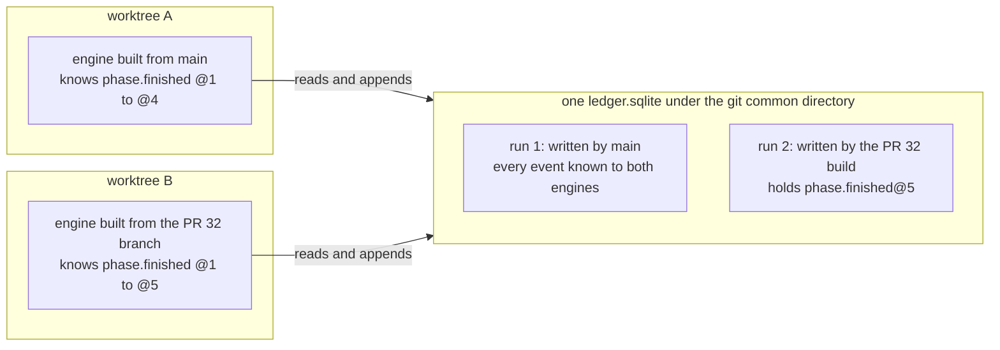
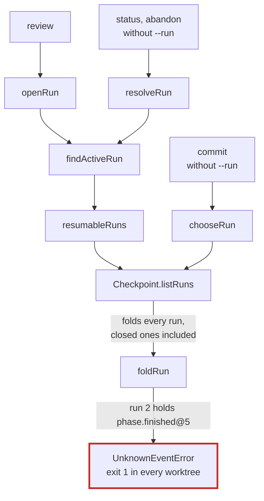
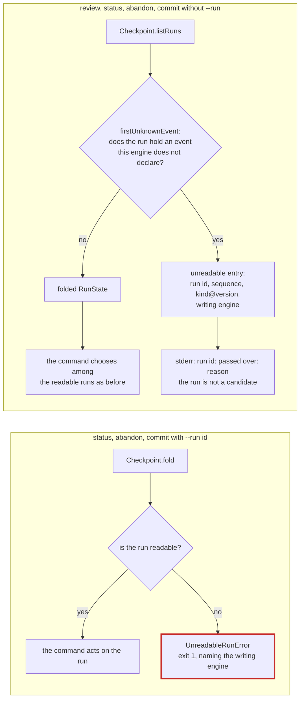
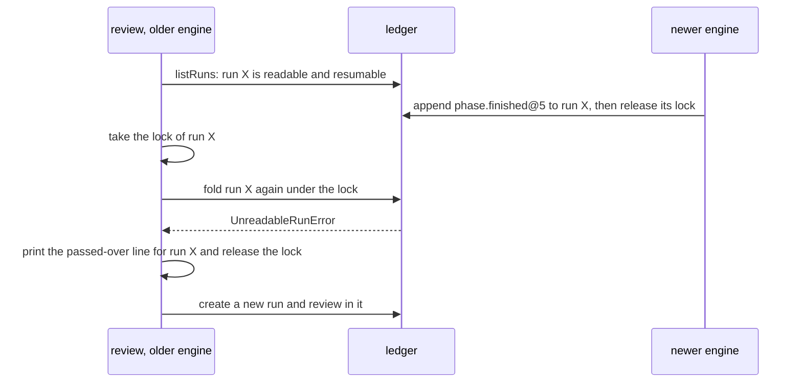

# Change Proposal: Unreadable runs

## Summary

An engine that meets a run holding an event whose kind and version its
model does not declare stops refusing to start because of it. Today
`Checkpoint.listRuns` folds every run of the ledger and the first
unknown event throws `UnknownEventError`, so one run written by another
engine build stops `review`, `status`, `abandon` and `commit` in every
worktree of the repository until the engine is replaced (issue #37).
After the change such a run is unreadable to this engine: a command that
picks a run passes over it and prints one line on stderr naming the
engine that wrote it and the first event this engine does not know, and
a command that names it with `--run` fails with a message that says the
same instead of the bare `UnknownEventError`. An unreadable run is never
called closed and never resumed, committed or abandoned by this engine.
The rule of the checkpoint ledger that a newer engine reads an older
ledger stands (its D4); this change adds what an older engine does with
a run it cannot read. No event kind, schema or table changes.

## Problem

A run is one review, from its scope to its report and, for a fix run,
its commits. The engine never stores a run's state: it records what
happens as events in a ledger and computes the state when it needs it
by applying the run's events in order, which the code calls folding.
Each event has a kind, a schema version, written `kind@version`, and
the identity of the engine that wrote it. An engine build knows a fixed
set of `kind@version`, declared in `src/checkpoint/events.ts`, and can
fold only a run whose every event is in that set.

The checkpoint is one ledger per repository, under the git common
directory (`locateCheckpoint` in `src/checkpoint/locate.ts`), so every
worktree and every engine build that runs in the repository shares it.
Two engine builds that know different sets of events can therefore
write runs into the same ledger:



Every command that picks a run without being told which one reads the
whole ledger:

- `review` resumes through `openRun`, which calls `findActiveRun`, which
  calls `resumableRuns` (`src/review/controller.ts`).
- `status` and `abandon` without `--run` call `findActiveRun` through
  `resolveRun` (`src/cli.ts`).
- `commit` without `--run` calls `chooseRun` (`src/review/commit.ts`),
  which filters every run for one it can commit.

All of them go through `Checkpoint.listRuns`, which folds every run,
closed ones included. `foldRun` throws `UnknownEventError` on the first
event whose `kind@version` the model lacks, as R4 of the checkpoint
ledger requires, and nothing catches it, so the command exits 1 with
`UnknownEventError: Event kind phase.finished version 5 is not in this
engine's registry`:



This happened. A fix run made with an engine built from the unmerged
change of #32, which adds `phase.finished@5`, completed and wrote its
report and commits. Afterwards the engine built from `main`, whose
registry ends at `phase.finished@4`, refused a read-only `review` of an
unrelated change in another worktree with the error above. Abandoning
the run would not have helped: the ledger is append-only, so its `@5`
events stay, and the older engine could not have appended the abandon
event to a run it cannot fold in any case.

Choosing a run does not need every run to be readable. A run that holds
an event this engine does not know cannot be resumed or committed by
this engine whatever its status, because the engine cannot fold the
state it would continue from. Such a run is not a candidate. The refusal
of two active runs exists because the choice between them would be
ambiguous; a run this engine cannot continue takes no part in that
choice.

## Goals

- One run this engine cannot read does not stop a command that does not
  need it, in any worktree.
- The operator is told, every time, which runs were passed over, which
  engine wrote each, and which event this engine does not know.
- A run this engine cannot read is never acted on by this engine: not
  resumed, committed, abandoned or appended to, and never reported as
  closed.
- A command that names an unreadable run fails, and its message names
  the engine that can read it.
- A command written later that picks a run cannot forget that a run may
  be unreadable: the type it reads says so.

## Non-Goals

- No change to forward compatibility. A newer engine reads an older
  ledger exactly as before, and within a run no event is ever skipped:
  `foldRun` and `applyEvent` still throw `UnknownEventError`, as R4 of
  the checkpoint ledger requires. What is passed over is a whole run.
- No partial state for an unreadable run. Its readable prefix is not
  folded or shown, and `status --json` does not list it (D3).
- No way for the older engine to abandon an unreadable run. Abandoning
  appends an event, which needs the folded state; the engine that wrote
  the run, or one that declares its events, abandons it.
- No marker that lets an engine declare an event safe for older engines
  to ignore. Every unknown event makes its run unreadable, however
  harmless it would have been.
- No silencing of the passed-over line, and no record that it was shown.
  It is printed by every command that passes the run over (Risks).
- No change to the event registry, the ledger DDL or any event, so no
  new golden fixture; `dist/` is built from `skill/` only and does not
  change.
- No change to `--run` with an id the ledger does not hold, which stays
  a usage error, or to the refusal of a run active in another worktree.

## Requirements

After the change a command reaches a run in one of two ways, and an
unreadable run is handled differently on each. A command that picks a
run sees every run as a folded state or an unreadable entry, and
chooses among the states only. A command that names a run with `--run`
folds that one run, and fails when it is unreadable:



- R1: `firstUnknownEvent(events, model)` in `src/checkpoint/fold.ts`
  returns the first event, in sequence order, whose `kind@version` the
  model has no declaration or no reducer for, as its sequence, kind,
  version and the engine that wrote it; or null when the model knows
  every event. It and `applyEvent` decide what is known by one shared
  predicate. `foldRun` and `applyEvent` are otherwise unchanged and
  still throw `UnknownEventError`.
- R2: `Checkpoint.listRuns()` returns, for every run of the ledger in
  ledger order, either its folded state or an unreadable entry holding
  the run id and the event R1 names. It never throws because of an
  unknown event. Any other failure to fold, such as
  `InvalidHistoryError`, still propagates.
- R3: `Checkpoint.foldRuns()` returns every run's folded state and
  throws `UnreadableRunError` on the first run this engine cannot read.
- R4: `Checkpoint.fold(runId)` and `Checkpoint.append(runId, ...)` on an
  unreadable run throw `UnreadableRunError`, which carries the run id,
  the event R1 names and this engine's identity, and whose message is
  `run <id> cannot be read: <reason>`. `append` writes nothing in that
  case. `append` of an event whose kind or version this engine does not
  declare still throws `UnknownEventError`, before any write.
- R5: The reason is one sentence, shared by the error and the
  passed-over line: the run holds `<kind>@<version>` at sequence `<n>`,
  written by engine `<writer>`, which this engine (`<reader>`) does not
  declare, and an engine that declares it, such as the one that wrote
  it, can read the run (D6).
- R6: `review`, `status` and `abandon` without `--run`, and `commit`
  without `--run`, choose among the readable runs only, and print on
  stderr one line `run <id>: passed over: <reason>` for each unreadable
  run, before anything else they print. When no run is passed over they
  print nothing more than today. An unreadable run takes no part in the
  refusal of two active runs and in the choice of the newest committable
  run.
- R7: When the run `review` found becomes unreadable before the run lock
  is taken, because another engine appended to it in between, the
  review prints the passed-over line, releases the lock and creates a
  new run, as it does today for a run that stopped being resumable in
  that window.
- R8: `status --run <id>`, `abandon --run <id>` and `commit --run <id>`
  on an unreadable run exit 1 with
  `UnreadableRunError: run <id> cannot be read: <reason>` on stderr.
- R9: With only unreadable runs in the ledger, `status` prints
  `No active run.` and exits 0, `status --json` prints `null` on stdout
  and the passed-over line on stderr only, `abandon` without `--run`
  refuses with `no active run to abandon`, and `review` creates a new
  run.
- R10: `README.md` says that an older engine refuses a newer ledger
  schema by name and passes over a run holding an event it does not
  know, naming the engine that wrote it.

The window of R7 is the one between the find, which reads every run
without a lock, and the run lock, under which `review` folds the run it
found again. Another engine that held the lock can append in it:



## Decisions

- **D1: A run this engine cannot read is passed over, not refused and
  not partly read.** This extends D4 of the checkpoint ledger, which
  promised only that a newer engine reads an older checkpoint and left
  the other direction to a refusal by name. A refusal is right for a
  newer schema, which can change the meaning of every row, and wrong for
  one newer run, which says nothing about the others. Keeping the
  refusal was rejected: one run blocks every worktree, and the
  append-only ledger leaves no remedy but replacing the engine. Skipping
  the unknown events and folding the rest of the run was rejected
  because R4 of the checkpoint ledger forbids it for a reason that still
  holds: a state missing an event is a wrong state, and an engine would
  act on it.

- **D2: An unreadable run is neither closed nor active to this
  engine.** The unknown event may have closed the run, or may be the
  next step of a run still going; the older engine cannot know which.
  Calling it closed could let the older engine report or treat an
  active run as finished; calling it active would bring back the block
  of D1 for every closed run. Passing it over is the one answer that is
  true either way. If the run is in fact active, the engine that can
  read it sees it beside any run the older engine started there, and its
  existing guard refuses with both ids.

- **D3: No partial fold of the readable prefix.** Folding up to the
  first unknown event would give a status, a scope and a phase, but the
  status is exactly what the unknown event may change, and no command
  needs the rest: the passed-over line identifies the run and its
  writer, which is what the operator acts on. `status --json` keeps
  printing the one active run or `null`, so its shape does not change.

- **D4: A tolerant `listRuns` beside a strict `foldRuns`, rather than
  one throwing method or a catch at each command.** `listRuns` returns
  a union of a state and an unreadable entry, so the compiler makes
  every reader, including a command written later, handle the
  unreadable case before it can read a state's fields. The scripts and
  tests that need every run folded call `foldRuns`, which fails loudly
  on an unreadable run instead of letting it pass unseen. A catch of
  `UnknownEventError` at each command was rejected: it repeats at every
  caller and is forgotten by the next one. The name `listRuns` is kept
  because the issue and the tests that intercept it name it.

  Which method of the checkpoint each caller reads, and what it does
  with an unreadable run:

  ```mermaid
  flowchart LR
    listRuns["listRuns"] -- "per run: RunState<br/>or unreadable entry" --> pickers["commands that pick a run,<br/>through the review layer helper"]
    foldRuns["foldRuns"] -- "per run: RunState,<br/>UnreadableRunError on the first unreadable" --> every["golden script and tests<br/>that need every run"]
    foldOne["fold, append"] -- "RunState,<br/>UnreadableRunError on an unreadable run" --> named["--run id, and every append"]
  ```

- **D5: Unreadable runs are found by a scan for the first unknown event,
  not by catching `UnknownEventError`.** The error names the kind and
  the version but not the sequence or the engine that wrote the event,
  and the message must name the engine. A catch would also have to tell
  a fold that met an unknown event from an append that offered one. The
  scan and `applyEvent` share one predicate, so they cannot disagree
  about what is known. Its cost is one more pass over each run's events
  in memory, small beside the fold itself.

- **D6: The message names the writing engine and does not call it
  newer.** An engine identity is a version and a bundle hash, or a
  version and `dev` for the sources, so it orders nothing: the evidence
  of this issue was written by a build of an unmerged branch, and a
  later build of `main` may never declare that event, or may declare
  the same version with a different shape. The message says which
  engine wrote the event and that an engine declaring it can read the
  run, which is true in every one of those cases.

- **D7: A named unreadable run exits 1 as an engine error, not 2 as a
  refusal.** `UnreadableRunError` is a `CheckpointError`, like
  `UnsupportedSchemaError`, the other case of a ledger written by an
  engine this one cannot follow, and `main` prints both as
  `<name>: <message>` with exit 1. A refusal, exit 2, is the engine
  declining a request it understood; here it cannot read the data, and
  the remedy is another engine, not another command.

- **D8: The passed-over line is printed by the review layer, not by the
  checkpoint.** One helper in `src/review/` turns the unreadable entries
  of `listRuns` into lines and returns the readable states, and the
  controller and `commit` share it. The checkpoint stays free of
  presentation, and every command that picks a run says the same thing
  in the same words.

- **D9: The older engine may start a run in a worktree where an
  unreadable run is still active.** Refusing when an unreadable run was
  created in the current worktree, which `run.created@1` would tell even
  an older engine, was considered and rejected: the older engine cannot
  tell an active run from a closed one (D2), so it would refuse in that
  worktree for every closed run the other engine ever made there, which
  is the block of D1 again for the worktree where the other engine is
  most used. What happens instead, when the unreadable run is in fact
  still active:

  ```mermaid
  sequenceDiagram
    participant N as newer engine, worktree A
    participant L as ledger
    participant O as older engine, worktree A
    N->>L: run X: append phase.finished@5, X stays active
    O->>L: review: X is unreadable and passed over
    O->>L: create run Y, active
    N->>L: review: X and Y are both active and readable to this engine
    N->>N: refused: 2 runs are active (X, Y), abandon all but one
  ```

## Risks

- Risk: the older engine starts a run in a worktree while a run of
  another engine is active there (D9). The engine that can read both
  refuses with both ids on its next resume, and the operator abandons
  one. Accepted: the guard already exists and names the remedy, and the
  alternative blocks the worktree.
- Risk: the passed-over line repeats on every command for as long as
  this engine is used, because the run stays in the append-only ledger.
  Accepted: the line names the engine to
  adopt, and a once-only notice would need state the ledger does not
  keep. Revisit if a repository gathers enough such runs that the lines
  drown the command's output.
- Risk: every unknown event makes its run unreadable, including one a
  newer engine added for a reason no older engine would care about.
  Accepted; marking events as safe to ignore is a promise about the
  meaning of events across engines, which the ledger has never made and
  which this change does not need.
- Risk: a ledger damaged so that a run holds an event no engine ever
  declared would now be passed over with a line rather than stop every
  command. Accepted: `append` refuses an undeclared event, so only
  another engine writes one, and the line still shows the run.

## Verification

No checks have run yet.
