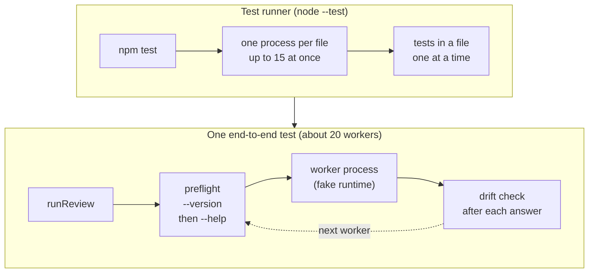
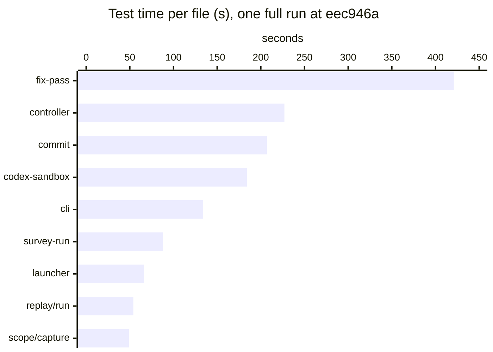
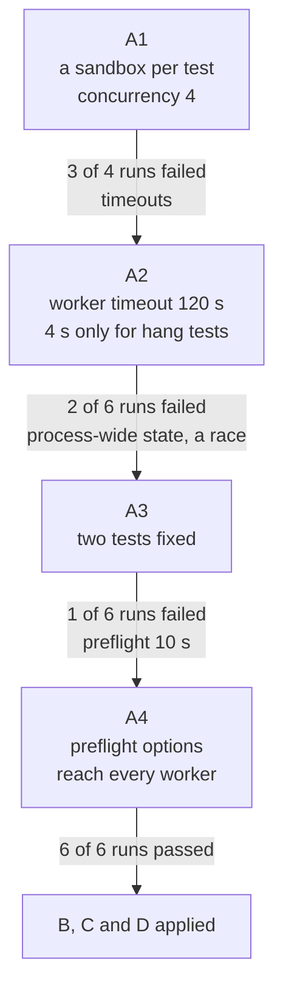
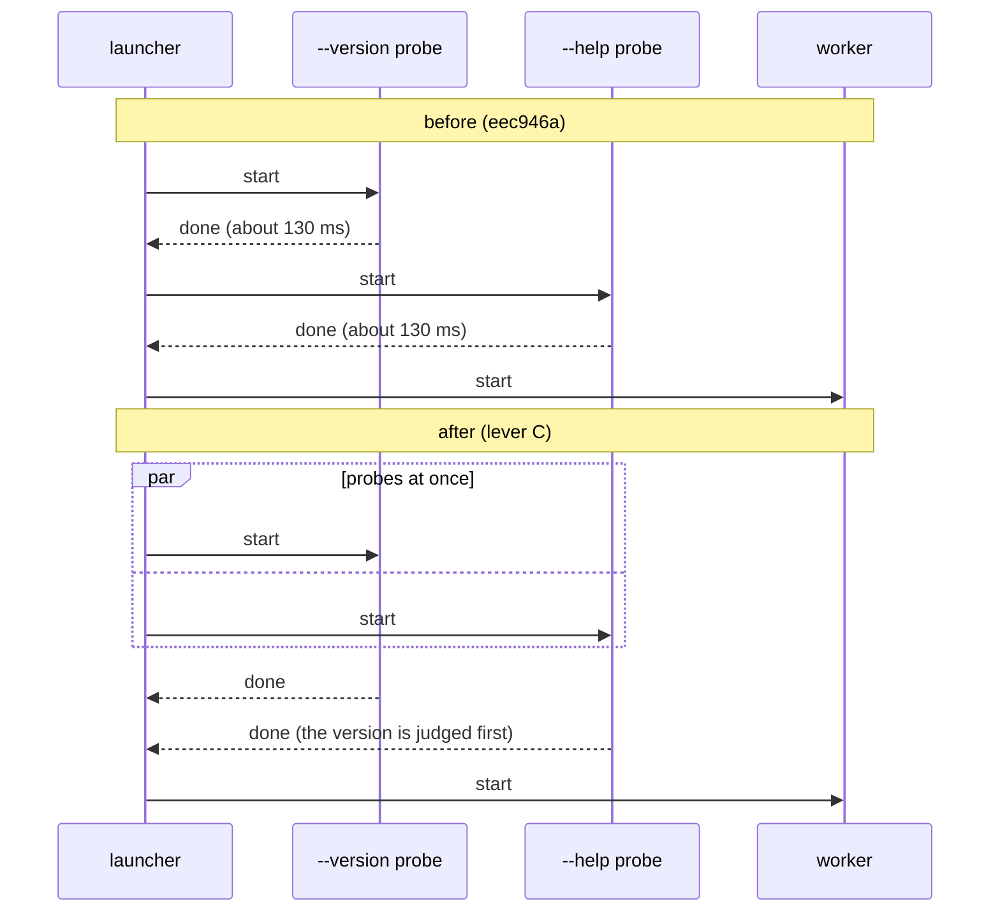

# Report: Test suite wall time

Written 2026-10-10, from measurements of `npm test` at `eec946a` and of
experiments on top of it, on one Windows 11 machine. It records where the
suite's wall time goes, what each change tried saved, and the failures
that running tests concurrently exposed, so the changes can be weighed
and committed later. Each lever names what it changes, what it saved,
and what it needed. The report was written before any change was
committed; "Decisions" at the end records what was committed and what
was not.

## Summary

- The suite's wall time is the time of its slowest file. The runner runs
  files in parallel but the tests of one file one at a time, and
  `test/review/fix-pass.test.ts` took 421 s of a 424 s run.
- Six files of end-to-end tests are 78% of all test time; the other 51
  files under 2 s each take 8.6 s together.
- An end-to-end test spends 89% of its wall time waiting on child
  processes. The largest share, 44%, is the preflight the engine runs
  before every worker, whose two probes run one after the other.
- A fake runtime process takes about 130 ms, of which about 90 ms is
  loading modules (zod among them) that a probe's answer does not need.
- `test/review/commit.test.ts` builds the same fix run again for most of
  its tests.

Four levers, applied one on top of another, took the suite from a median
of 297 s to 144 s, with three runs of each side alternating and every
run passing. The first lever, concurrent tests within a file, exposed
three kinds of failure the serial suite had hidden: timeouts sized for
serial runs, a test that asserts on process-wide state, and a test that
infers concurrency from event order. Each was fixed at its cause.

A fifth lever, added after the decisions below, turns on Node's compile
cache for every process the suite starts: on top of the committed
levers it cut the CPU the run's Node processes used by 38% and the wall
time by about 17%.

Three decisions were left to the author: whether a preflight that times
out should disqualify the runtime mid-run; a change proposal for lever
C, which changes observable behavior; and whether the concurrency stays
at 4. "Decisions" at the end records how each was settled: A, B and D
are committed, C is not taken, and the preflight timeout is issue #34.

## Terms

The report uses the engine's and the tests' names as they are.

| Term | Meaning | Where |
|---|---|---|
| worker | One run of a model CLI (Claude Code or Codex) within a review, one per role and unit. | `src/runtime/launcher.ts` |
| preflight | The check that an executable is the runtime it claims, before the review starts and again before every worker. | `src/runtime/preflight.ts` |
| probe | One command a preflight runs: a `--version` probe, and `--help` probes for the flags the adapter uses (one for Claude, three for Codex). | `src/runtime/preflight.ts` |
| drift check | The check, after every answer, that HEAD and the tree are what the run expects, run through git. | `src/review/tree.ts` |
| fake runtime | The Node script a test starts in place of a model CLI; it answers from a JSON script. | `test/helpers/fake-claude.ts`, `fake-codex.ts`, `fake-runtime.ts` |
| ReviewSandbox | The test helper that makes a temporary repository, a roles directory with a test policy and a script for the fakes, and calls the real `runReview`. Only the model CLIs and the checks are fakes. | `test/helpers/review-sandbox.ts` |
| end-to-end test | A test that runs a review or a fix pass through a ReviewSandbox from start to end. | `test/review/*.test.ts`, `test/cli.test.ts` |
| fixture | The state a test builds before what it checks; here, a finished fix run. | `test/review/commit.test.ts` |
| concurrency | The `node:test` option on `describe` and `it`: how many tests of a file run at once. The default is one; a nested describe inherits its parent's value. The tests share one thread and interleave their async work. | the test runner |

How they nest: an end-to-end test runs one or more reviews in one
ReviewSandbox. A review starts about 20 workers in these tests. Before
each worker the engine runs one preflight, and a preflight runs two
probes (Claude) or four (Codex). In the tests every worker and every
probe is a fake runtime process.

Files are another matter: `node --test` runs each file in a process of
its own, by default as many at once as the machine has logical cores
minus one.

## Data and method

The baseline is `eec946a`: 79 test files and 1,640 tests (1,621 passed,
19 skipped). Every measurement ran on one machine with Windows 11, 16
logical cores and Node 26.10.0, with the command `npm test` runs.

Five methods, each with its script in the appendix:

1. **Time per file and per test.** A `node:test` reporter writes each
   test's file, name, duration, outcome and failure message to JSON. A
   file's time is the sum of its top-level tests' durations. The time a
   reporter receives an event is no use: the runner delivers a file's
   events together after the file ends.
2. **Child processes.** A preload module wraps `spawn`, `execFile`,
   `execFileSync` and `spawnSync` and logs each command and its wall
   time. Given through `NODE_OPTIONS`, it reaches the fakes the engine
   starts too.
3. **CPU.** The test process's own CPU time (`process.cpuUsage`), and
   the machine's CPU load sampled every 2 s.
4. **Microbenchmarks.** The start of one fake process and one preflight,
   each a mean of 20.
5. **Before and after.** The two sides run alternately (before, after,
   before, after), so a change in the machine's load does not fall on
   one side. The final comparison ran the baseline from a separate
   worktree, three runs of each side.

Two cautions. During some runs another program used 1.5 to 3.2 cores;
those runs count for pass and fail only, not for time. And the baseline
took 424 to 456 s in some runs and 294 to 301 s in others on the same
day, so only runs made alternately are compared with each other.

## How a run spends its time

The findings below follow a test run in the order things happen
(Figure 1).



Figure 1. From `npm test` to one worker of one end-to-end test. The upper
group is the test runner's work, the lower one the engine's.

### 1. The runner runs the tests of a file one at a time

- **Where.** `test/review/fix-pass.test.ts`, `controller.test.ts`,
  `commit.test.ts`, `codex-sandbox.test.ts`, `survey-run.test.ts` and
  `test/cli.test.ts`. Each keeps its sandbox in one describe-level
  `let box`, which `beforeEach` replaces and `afterEach` closes.
- **Problem.** The suite's wall time is bound to its slowest file, and
  the concurrency option cannot simply be turned on: tests running at
  once would overwrite `box` and close each other's sandboxes.
- **Evidence.** In a 424 s run, fix-pass's 30 tests took 421 s
  (Figure 2). The six files are 78% of the 1,626 s all files took.
- **Lever.** A, a sandbox per test and concurrency in each file.



Figure 2. The sum of each file's test durations, the nine largest,
measured while the files ran at once.

### 2. The engine runs a preflight before every worker

- **Where.** `qualify` in `src/runtime/launcher.ts`, and `preflight` in
  `src/runtime/preflight.ts`.
- **What happens.** Before each worker the launcher qualifies the
  executable again. The preflight waits for the `--version` probe to end
  before it starts the `--help` probes.
- **Problem.** In the tests a probe is a fake process too, so two
  processes run one after the other in front of every worker.
- **Evidence.** One fix-pass test ("fixes the fixer-routed findings, one
  cluster per file, ...") traced alone took 9.7 s, and at least one
  child process ran for 8.5 s of them (89%). By kind (the kinds overlap
  in places, so the shares do not add up to 89%):

| Kind | Processes | Time some process of the kind ran | Share of the test |
|---|---|---|---|
| preflight probe (`--version`, `--help`) | 42 | 4.2 s | 44% |
| worker | 20 | 2.4 s | 25% |
| synchronous git (drift check, scope capture, sandbox setup) | about 75 | 2.4 s | 25% |
| other (checks, snapshot) | 10 | 0.4 s | 4% |

- **Lever.** The preflight before every worker is by design:
  `docs/changes/2026-09-27-read-only-review.design.md` has a runtime that
  breaks mid-run found by the next worker's own preflight, and
  `test/review/controller.test.ts` tests it. Its frequency stays. Running
  the probes at once is lever C.

### 3. A fake loads modules its probe answer does not need

- **Where.** `test/helpers/fake-runtime.ts` imports
  `src/review/vocabulary.ts` (which imports zod) and
  `src/review/prompts.ts` statically, and `fake-claude.ts` and
  `fake-codex.ts` import it whatever they are asked.
- **Problem.** A probe prints a version or a list of flags, and loads
  the code that answers a worker's script first.
- **Evidence.** On an idle machine `node -e 0` took 34 ms,
  `fake-claude.ts --version` 134 ms, `--help` 131 ms and
  `fake-codex.ts --version` 119 ms. Importing zod took 53 to 60 ms,
  `src/runtime/claude.ts` 24 to 28 ms and `fake-runtime.ts` 9 to 11 ms.
  The test traced in finding 2 starts a fake 62 times.
- **Lever.** D.

### 4. The commit tests build the same fix run again and again

- **Where.** The `fixRun` helper of `test/review/commit.test.ts`.
- **What happens.** Each of 11 tests runs a whole fix pass, at
  `concurrency: 1`, before it checks `deep-review commit`. Six of them
  build the same run from the same script, `twoFixes`.
- **Problem.** What the tests check is the commit; most of their time is
  the fixture.
- **Evidence.** In a full run a test of this file took 28 s on average
  (17.9 to 46.8 s), the longest of any file. The file runs 13 reviews.
- **Lever.** B.

### 5. Files running at once slow each test down

- **Where.** No one place: the machine.
- **What happens.** Up to 15 files run at once, each starting workers
  and probes, and starting a process is expensive on Windows.
- **Evidence.** The test traced in finding 2 took 9.7 s alone and 24.7 s
  in a full run.
- **Lever.** None of its own: it shrinks with findings 2 and 3, and it
  set the concurrency A uses.

### Not a cause

- **Unit tests, sleeps and timeouts.** The unit tests' 51 files take
  8.6 s together. Two tests wait for a worker timeout (`hang: true`),
  4 s each.
- **Synchronous git.** A git call of the drift check (`execFileSync` in
  `src/scope/git.ts`) stops the event loop while it runs, so concurrent
  tests in one file were expected not to overlap well. Measured, they
  do: with fix-pass alone at concurrency 4 and 8, the test process's
  main thread used 21 to 25% of one core while the machine's CPU stood
  at 77 to 80% on average and 99% at its peak. The limit is starting
  processes, not the main thread.

## Levers

Each lever: what changed, what it measured, its risk, what it takes, and
where it stands. They were applied in the order A, B, C, D, each on top
of the ones before; E came after the decisions, on top of what was
committed. Lever A took four steps, A1 to A4, because each run
of the suite exposed a failure the step before had not (Figure 3).



Figure 3. The steps of lever A, and the full runs at concurrency 4 that
led from each to the next: the label on an arrow is what failed, and
what the next step fixed.

### A. A sandbox per test, and concurrency within each file

- **Change.**
  - `test/helpers/review-sandbox.ts` gains `ReviewSandbox.forTest(t)`,
    a sandbox for test `t` alone that `t.after` closes, and
    `sandboxConcurrency` (4), the one place the value lives.
  - Each test of the six files starts with
    `const box = ReviewSandbox.forTest(t);`, and the describe-level
    helpers take `box` as an argument.
  - The first describe of `codex-sandbox.test.ts` shared a `launched`
    array and the runtimes that record into it across its tests;
    `spied(t)` now builds both and the helpers for each test.
  - `cli.test.ts` ran the CLI with `spawnSync`, and a synchronous test
    cannot overlap another whatever the concurrency. An async `node()`
    resolves with the same `status`, `stdout` and `stderr`, and every
    call is awaited.
  - `test/replay/run.test.ts` and `script.test.ts` already build one
    sandbox in `before`, and are left alone.
- **Measured.** The concurrency was chosen on fix-pass alone. All 30
  tests passed in every run:

| Concurrency | File, run 1 | File, run 2 | Median test, run 1 |
|---|---|---|---|
| 1 (as at `eec946a`) | 250 s | | 8.1 s |
| 2 | 163 s | | 10.7 s |
| 4 | 132 s | 119 s | 16.9 s |
| 8 | 196 s | 112 s | 40.5 s |

  Past 4 each test slows down as much as the overlap gains, since the
  machine's CPU is near its limit; the two runs at 8 differ widely and
  neither beats 4 clearly.

  The other five files alone, before and after, every test passing:

| File | Before | After |
|---|---|---|
| `controller.test.ts` | 138 s | 88 s |
| `commit.test.ts` | 119 s | 53 s |
| `codex-sandbox.test.ts` | 100 s | 49 s |
| `cli.test.ts` | 64 s | 25 s |
| `survey-run.test.ts` | 36 s | 23 s |

  Full runs with A1 took 200, 210, 203 and 264 s, and three of the four
  failed; the fourth failed five tests, all in converted files. A1 alone
  is not usable. The three failure classes and their fixes follow.

#### Failure 1: timeouts sized for serial runs (A2, A4)

- **Where.** The roles policy `test/helpers/review-sandbox.ts` writes,
  and the preflight `src/runtime/launcher.ts` runs before every worker.
- **What happens.** The sandbox's policy gave every role a 4 s worker
  timeout, `hangTimeoutMs`, a value meant for the two tests that script
  a worker that hangs. Under the load of concurrent tests a fake that
  answers took longer than that to start.
- **Problem.** A worker that would have answered is killed and retried,
  the run's history changes, and assertions fail: a commit test found an
  extra "partial edits of batch c1-1" commit, a controller test 20
  workers where 19 were expected.
- **Evidence.** The five failures of the fourth A1 run. One of them is a
  `fake-claude.ts --version` probe that did not end within the
  preflight's default 10 s.
- **Fix.**
  - A2: every role gets `workerTimeoutMs` (120 s) and every check 120 s;
    a test that scripts a hang calls `box.shortenTimeout(role)` to give
    that role alone the 4 s.
  - A4: `ReviewOptions.preflightOptions` reached the preflight at the
    review's start (`src/review/controller.ts`) but not the one before
    each worker. `RunWorkerOptions.preflightOptions` now carries it to
    the launcher's preflight. The CLI passes no preflight options, so
    the CLI does not change. The sandbox passes a 120 s probe timeout. A
    new launcher test shows the options reach a worker's preflight; it
    fails when the launcher drops them.

#### Failure 2: a test that asserts on process-wide state (A3)

- **Where.** "ends with the launcher's error when the run is abandoned
  under a running worker, and no rejection goes unhandled" in
  `test/review/controller.test.ts`.
- **What happens.** The test counts SIGINT listeners and unhandled
  rejections, both of which the whole process shares, and every run lock
  adds listeners while it is held (`releaseOnExit` in
  `src/review/lock.ts`).
- **Problem.** The locks of the tests running beside it change the count
  (4 listeners where 3 were expected).
- **Evidence.** The third run of A2.
- **Fix.** The test moves to a top-level describe of its own after the
  concurrent one. The top-level describes of a file run one after
  another, so it runs alone once the concurrent tests have ended; a toy
  file confirmed that order, also under `--test-concurrency=8`.

#### Failure 3: a test that infers concurrency from event order (A3)

- **Where.** "fixes the fixer-routed findings, one cluster per file,
  ..." in `test/review/fix-pass.test.ts`.
- **What happens.** The test takes the two fixers to have run at once
  when both `worker.launched` events come before the first
  `worker.finished`. A worker's `worker.launched` is recorded after its
  own preflight.
- **Problem.** Under load the first fixer can answer before the second
  one's preflight ends, so the test fails although the engine started
  both together. The race predates A; concurrency 2 met it too.
- **Evidence.** The sixth run of A2, at concurrency 2.
- **Fix.** Both fixers wait for one marker file, which the test writes
  once the ledger shows both running. The assertion now holds by
  construction, and an engine that ran the fixers one after another
  would fail it at the 120 s wait.

Looking for the same kind of race, "blocks on the run budget before a
launch" in the controller tests was checked and left as it is: the engine
decides the four finder launches against the budget in one step, so when
the workers finish does not change the outcome.

- **Risk.** Tests that share state the way the three above did can be
  written again; a reviewer has to know that the files now run their
  tests concurrently.
- **Takes.** The changes above, all in tests except A4's options, which
  touch `src/runtime/launcher.ts` and `src/review/controller.ts` without
  changing the CLI.
- **Status.** Committed, the concurrency fixed at 4; see "Decisions".

### B. The commit tests build their shared run once

- **Change.** `ReviewSandbox.keep()` copies the whole sandbox,
  repository and checkpoint included, beside it, and `restore()` puts it
  back at the same path. The six commit tests that start from the
  default run move into one nested describe, which makes the run once in
  `before` and restores it in `beforeEach`. It restores at the same path
  because `commitRun` refuses a run reviewed in another worktree
  (`src/review/commit.ts`), and for the same reason the describe sets
  `concurrency: 1`; without it, it would inherit its parent's 4.
- **Measured.** The file runs 8 reviews instead of 13. The file alone,
  alternating: 52 and 55 s before, 35 and 38 s after, all 11 tests
  passing each time.
- **Risk.** The six tests share one state between restores; a test that
  wrote outside the sandbox directory would leak into the next.
- **Takes.** The two files above, tests only.
- **Status.** Committed; see "Decisions".

### C. The preflight's probes at once

- **Change.** `preflight` in `src/runtime/preflight.ts` starts the
  `--version` probe and the `--help` probes together with
  `Promise.allSettled`, and judges the version first once all have
  ended, so an executable that fails it, or is not the runtime, is
  refused for that as before (Figure 4).
- **Behavior change.** The help probes run even when the version check
  then fails, and the preflight returns only when every probe has ended,
  each bounded by the probe timeout.
- **Measured.** 20 preflights in a row, alternating: Claude 275 and
  275 ms before, 138 and 132 ms after; Codex 265 and 271 ms before, 140
  and 135 ms after. A real review saves the same share before every
  worker. The preflight, process, launcher and contract tests: 142
  passed, 6 skipped (POSIX only), none failed.
- **Risk.** An executable that is not the runtime is run with `--help`
  as well as `--version`.
- **Takes.** `src/runtime/preflight.ts` and a change proposal, since the
  behavior changes.
- **Status.** Not taken; see "Decisions".



Figure 4. The preflight in front of one worker, before and after lever
C. The times are means measured with the fake runtimes.

### D. The fakes answer a probe without loading the worker code

- **Change.** `environment`, `versionOutput` and `printHelp` move to a
  new `test/helpers/fake-probe.ts`, which imports only `node:fs`.
  `fake-claude.ts` and `fake-codex.ts` import it statically and load
  `fake-runtime.ts` dynamically only when they act as a worker.
  `fake-claude.ts --help` still takes its flags from
  `src/runtime/claude.ts`, so the fake cannot drift from the adapter;
  that module pulls in no zod.
- **Measured.** Alternating: one probe process from 115 to 130 ms down
  to 56 to 74 ms, against 30 to 35 ms for `node -e 0`; one preflight,
  with C applied, from 129 to 142 ms down to 70 to 74 ms. C and D
  together take a preflight from about 270 ms to about 70 ms. The
  runtime tests: 343 passed, 6 skipped, none failed.
- **Risk.** None found.
- **Takes.** The four helper files, tests only.
- **Status.** Committed; see "Decisions".

### E. Node's compile cache for every process the suite starts

- **Change.** `test/helpers/compile-cache.ts` turns on Node's on-disk
  compile cache for the test process and, through `NODE_COMPILE_CACHE`,
  for every Node process it starts; `test/setup.ts` calls it. The
  default directory is `node_modules/.cache/node-compile-cache`, which
  git ignores and `npm ci` clears. A directory `NODE_COMPILE_CACHE`
  already names is kept, made absolute: the fakes run in sandbox
  worktrees, and Node reads a relative directory against each process's
  own working directory. `NODE_DISABLE_COMPILE_CACHE`, whatever its
  value, leaves the cache off, as it does for Node itself.
- **Evidence.** A full run starts 6,404 Node processes: 4,392 of
  `fake-claude.ts`, 1,394 of `fake-codex.ts`, 107 of `src/cli.ts`, and
  the test files and checks. Each compiled the same TypeScript modules
  from scratch. Loading a fake worker's modules took 193 to 295 ms
  without the cache and 144 to 213 ms with it, and `src/cli.ts --help`
  366 to 417 ms against 251 to 346 ms.
- **Measured.** The full suite with the cache off and on, alternating,
  the cache emptied before each run that used it. With `cpu-total.mjs`
  (appendix) summing every Node process's CPU:

| Run | Off: Node CPU | Off: wall | On: Node CPU | On: wall |
|---|---|---|---|---|
| 1 | 858 s | 190 s | 527 s | 158 s |
| 2 | 873 s | 204 s | 539 s | 168 s |

  The CPU of `fake-claude.ts` alone fell from 508 to 278 s. Three
  earlier pairs measured by wall time only came out at 273, 193 and
  324 s off against 179, 261 and 196 s on: one pair reversed, as other
  work on the machine moved the wall times, which is why the CPU sum is
  the measure here. Every run passed.
- **Risk.** The cache under `node_modules/` grows as sources change,
  until the next `npm ci`; Node keys its entries by content, so a stale
  one is not used.
- **Takes.** The helper, `test/setup.ts`, and six tests in
  `test/compile-cache.test.ts`, tests only.
- **Status.** Committed; see "Decisions".

## Final comparison

With A4, B, C and D applied, the suite's median fell from 297 s to
144 s. The baseline ran from a separate worktree, three runs of each side
alternating, and every run passed (1,641 tests with the new launcher
test):

| Run | `eec946a` | All levers |
|---|---|---|
| 1 | 297 s | 139 s |
| 2 | 294 s | 144 s |
| 3 | 301 s | 181 s |

The third run of the levers took longer than the other two on the same
code, which puts it down to the machine's load at the time.

The sum of all files' time in the first run fell from 1,270 s to 740 s:

| File | `eec946a` | All levers |
|---|---|---|
| `fix-pass.test.ts` | 295 s | 136 s |
| `controller.test.ts` | 192 s | 99 s |
| `commit.test.ts` | 172 s | 64 s |
| `codex-sandbox.test.ts` | 153 s | 82 s |
| `cli.test.ts` | 109 s | 43 s |
| `survey-run.test.ts` | 67 s | 49 s |
| `launcher.test.ts` | 56 s | 45 s |

fix-pass is still the suite's wall time: 136 s of a 139 s run.

## Decisions for the author

These were open when the report was written; "Decisions" at the end
records how each was settled.

### 1. Whether a preflight that times out disqualifies the runtime

- **Where.** The preflight `src/runtime/launcher.ts` runs before every
  worker, and `src/review/controller.ts`, which turns its failure into a
  refusal.
- **What happens.** When a probe of that preflight times out, the engine
  refuses the running review as `runtime-unqualified`, with an action to
  reinstall the runtime.
- **Problem.** A probe that is only slow is treated like an executable
  that is no longer the runtime, so a review can stop on a machine that
  is merely busy.
- **Evidence.** In the fifth run of A3 a `fake-claude.ts --version` did
  not end within 10 s and a survey-run test failed with this refusal.
  It was seen under test load only.
- **Options.** Treat a timeout as a failed attempt of the worker and
  retry it, or keep it as a disqualification. No experiment changed it.

### 2. A change proposal for lever C

C changes observable behavior, which the repository's rules give a
change proposal; its gain is that every worker of a real review waits
half as long for its preflight. A4's product change does not change the
CLI, so its commit message can say so instead.

### 3. The concurrency

4 passed six runs of A4 and three of the final comparison, and was the
fastest on fix-pass alone. The alternating comparison of 4 and 2 on the
full suite ran while another program loaded the machine, so it settled
nothing. The proposal: keep 4, compare it with 2 again on an idle
machine, and fix the value in the code before the commit.

## Not a lever here

- **Fewer preflights.** Remembering the preflight within a run would
  remove most of finding 2's 44%, but it gives up the design's mid-run
  detection, and after C and D a preflight costs about 70 ms.
- **Asynchronous git in the engine.** The test process's main thread was
  not the limit ("Not a cause").

## Open questions

- Whether concurrency 2 beats 4 on the full suite on an idle machine.
- How far fix-pass can shrink, split into several files or with fewer
  reviews per test; it bounds the suite now.

## Decisions

Settled by the author on 2026-10-10, after the report was written.

1. **Levers A, B and D are committed**, A with A4's change to the
   preflight options. In order:
   - `0b1f20a` passes the preflight options to every worker's preflight
     (A4).
   - `04e093b` names issue #34 in the comment on `refusalOf`.
   - `dcf663b` fixes failure 3's race (A3).
   - `2a1f31c` sizes the sandbox's timeouts (A2).
   - `ee4f2d3` gives each test a sandbox and runs a file's tests four at
     a time, moving failure 2's test to a describe of its own (A1, A3).
   - `8bcd681` builds the commit tests' shared run once (B).
   - `e7ed484` answers the fakes' probes without the worker code (D).

   `npm run check` and `npm run verify` passed at `e7ed484`.
2. **Lever C is not taken.** Its gain is too small to be worth a change
   in observable behavior: with D a probe is short, and C would save one
   probe per worker, about 5 to 10% of the suite by estimate. The final
   comparison above was measured with C applied, so the suite as
   committed is slower than its 144 s by about that much; it was not
   measured again.
3. **A preflight that times out is a separate matter** from the suite's
   speed. Issue [#34](https://github.com/josephjang/deep-review/issues/34)
   tracks it, and the comment on `refusalOf` in `src/review/controller.ts`
   names the issue.
4. **The concurrency stays at 4**, fixed in
   `test/helpers/review-sandbox.ts`; the experiment's
   `SANDBOX_CONCURRENCY` variable is gone. Whether 2 is faster on an idle
   machine stays among the open questions.
5. **Lever E was added afterwards**, at the author's request, as
   `81a8faf`, on top of the commits above.

## Appendix: measurement scripts

The commands run from the repository root. `<tools>` is the directory
holding these scripts; on Windows, a path given to `--test-reporter` or
`--import` is written as a `file:///` URL.

### Time per file and per test

`reporter.mjs` writes each test's file, name, depth, duration, outcome
and failure message to the JSON file `TIMINGS_OUT` names. `per-file.mjs`
sums a file's top-level test durations.

```sh
TIMINGS_OUT=timings.json node --import ./test/setup.ts --test --test-reporter=file:///<tools>/reporter.mjs "test/**/*.test.ts"
node <tools>/per-file.mjs timings.json
```

```js
// A node:test reporter for the measurements: every test's file, name,
// nesting, duration and outcome, written as JSON to TIMINGS_OUT, with the
// failures' messages, and a summary line on stdout.
import { writeFileSync } from 'node:fs';

export default async function* reporter(source) {
  const rows = [];
  for await (const ev of source) {
    if (ev.type === 'test:pass' || ev.type === 'test:fail') {
      const d = ev.data;
      const error = ev.type === 'test:fail' ? d.details?.error : undefined;
      rows.push({
        file: d.file,
        name: d.name,
        nesting: d.nesting,
        ms: d.details?.duration_ms,
        type: d.details?.type,
        skip: !!d.skip,
        ok: ev.type === 'test:pass',
        error: error === undefined ? undefined : String(error.cause?.stack ?? error.cause ?? error.stack ?? error).slice(0, 4000),
      });
    }
  }
  writeFileSync(process.env.TIMINGS_OUT, JSON.stringify({ rows }));
  const failed = rows.filter((row) => !row.ok && row.type !== 'suite');
  yield `rows ${rows.length}, failed ${failed.length}\n`;
  for (const row of failed) yield `FAILED ${row.file} :: ${row.name}\n${row.error}\n\n`;
}
```

```js
// Per-file test time from a reporter.mjs output: the sum of each file's top-level test durations.
//   node per-file.mjs <timings.json>
import { readFileSync } from 'node:fs';
import { basename } from 'node:path';

const { rows } = JSON.parse(readFileSync(process.argv[2], 'utf8'));
const byFile = new Map();
for (const row of rows) if (row.nesting === 0) byFile.set(row.file, (byFile.get(row.file) ?? 0) + row.ms);
const sorted = [...byFile].sort((a, b) => b[1] - a[1]);
const total = sorted.reduce((sum, [, ms]) => sum + ms, 0);
console.log(`sum of per-file time: ${(total / 1000).toFixed(0)} s`);
for (const [file, ms] of sorted.slice(0, 15)) console.log(`${(ms / 1000).toFixed(1).padStart(7)} s  ${basename(file)}`);
```

### Child processes

`trace.mjs` wraps four `child_process` functions and appends one line
per process to the file `SPAWN_TRACE` names; `kind` is `sync`, `async`,
or `self` for the process's own lifetime.

```sh
SPAWN_TRACE=trace.jsonl NODE_OPTIONS="--import=file:///<tools>/trace.mjs" node --import ./test/setup.ts --test --test-name-pattern="one cluster per file, runs the checks" test/review/fix-pass.test.ts
```

```js
// Preload: log every child process (argv summary, wall ms) and this process's own lifetime.
import cp from 'node:child_process';
import { appendFileSync } from 'node:fs';
import { basename } from 'node:path';
import { syncBuiltinESMExports } from 'node:module';
const out = process.env.SPAWN_TRACE;
const t0 = performance.now();
const tail = (x) => basename(String(x).replaceAll('\\', '/'));
const label = (file, args) => {
  const base = tail(file);
  const a = (args || []).map(String);
  if (/^node(\.exe)?$/i.test(base)) {
    const script = a.find((x) => !x.startsWith('-'));
    const next = a[a.indexOf(script) + 1];
    return `node ${script ? tail(script) : ''} ${next && !/[\\/]/.test(next) ? next : ''}`.trim();
  }
  if (/^git(\.exe)?$/i.test(base)) return 'git ' + a.filter((x) => !x.includes('/') && !x.includes('\\')).join(' ').slice(0, 70);
  return `${base} ${a.slice(0, 2).join(' ').slice(0, 40)}`;
};
const log = (kind, l, ms) => appendFileSync(out, JSON.stringify({ pid: process.pid, ppid: process.ppid, kind, l, ms: Math.round(ms), at: Math.round(performance.timeOrigin + performance.now()) }) + '\n');
for (const name of ['execFileSync', 'spawnSync']) {
  const orig = cp[name];
  cp[name] = function (file, args, ...rest) {
    const s = performance.now();
    try { return orig.call(this, file, args, ...rest); } finally { log('sync', label(file, Array.isArray(args) ? args : []), performance.now() - s); }
  };
}
for (const name of ['spawn', 'execFile']) {
  const orig = cp[name];
  cp[name] = function (file, args, ...rest) {
    const s = performance.now();
    const c = orig.call(this, file, args, ...rest);
    const l = label(file, Array.isArray(args) ? args : []);
    c.once('exit', () => log('async', l, performance.now() - s));
    return c;
  };
}
syncBuiltinESMExports();
process.on('exit', () => log('self', process.argv.slice(1).map(tail).slice(0, 2).join(' '), performance.now() - t0));
```

### CPU

`cpu.mjs` prints a test file process's own CPU time when it exits; it is
given on the command line, not through `NODE_OPTIONS`, so the fakes do
not load it. `cpu-sample.ps1` records the machine's CPU load and the
number of node and git processes every 2 s.

```sh
node --import ./test/setup.ts --import file:///<tools>/cpu.mjs --test test/review/fix-pass.test.ts
```

```js
// Preload for one test file process: at exit, print its own CPU time against its wall time.
const t0 = performance.now();
process.on('exit', () => {
  const { user, system } = process.cpuUsage();
  const wall = performance.now() - t0;
  const cpu = (user + system) / 1000;
  process.stderr.write(`wall=${(wall / 1000).toFixed(0)}s mainThreadCpu=${(cpu / 1000).toFixed(0)}s (${((cpu / wall) * 100).toFixed(0)}% of one core)\n`);
});
```

```powershell
# Sample machine CPU % and the number of node.exe and git.exe processes every 2 s until the stop file exists.
param([string]$Out, [string]$Stop)
while (-not (Test-Path $Stop)) {
  $cpu = (Get-CimInstance Win32_Processor | Measure-Object -Property LoadPercentage -Average).Average
  $node = @(Get-Process node -ErrorAction SilentlyContinue).Count
  $git = @(Get-Process git -ErrorAction SilentlyContinue).Count
  Add-Content -Path $Out -Value "$cpu $node $git"
  Start-Sleep -Seconds 2
}
```

`cpu-total.mjs` sums the CPU of a whole run's Node processes, the fakes
and the CLI included, for lever E: given through `NODE_OPTIONS`, every
Node process appends its own CPU milliseconds and entry script to the
file `CPU_TOTAL_OUT` names.

```sh
CPU_TOTAL_OUT=cpu.txt NODE_OPTIONS="--import=file:///<tools>/cpu-total.mjs" node --import ./test/setup.ts --test "test/**/*.test.ts"
awk '{ s += $1 } END { printf "%d processes, %.0f s of CPU\n", NR, s / 1000 }' cpu.txt
```

```js
// Preload, given through NODE_OPTIONS so every Node process of a run loads
// it: at exit, append this process's own CPU milliseconds (user + system)
// and its entry script to the file CPU_TOTAL_OUT names. Summing the file
// gives the CPU the run's Node processes used, which other load on the
// machine moves far less than wall time.
import { appendFileSync } from 'node:fs';
import { basename } from 'node:path';

const out = process.env.CPU_TOTAL_OUT;
process.on('exit', () => {
  if (out === undefined) return;
  const { user, system } = process.cpuUsage();
  const entry = process.argv.slice(1).find((arg) => !arg.startsWith('-')) ?? '';
  appendFileSync(out, `${Math.round((user + system) / 1000)} ${basename(entry.replaceAll('\\', '/'))}\n`);
});
```

### Microbenchmarks

`bench-probes.mjs` times one fake process answering a probe, and
`bench-preflight.mjs` one preflight, each a mean of 20.

```sh
node <tools>/bench-probes.mjs . 20
node <tools>/bench-preflight.mjs . 20
```

```js
// Mean wall time of one fake process answering a probe, from the repository
// given:  node bench-probes.mjs <repo> [count]
import { execFileSync } from 'node:child_process';
import { join } from 'node:path';

const repo = process.argv[2];
const count = Number(process.argv[3] ?? 20);
const quiet = { stdio: 'ignore', windowsHide: true };
const time = (label, args) => {
  execFileSync(process.execPath, args, quiet);
  const start = performance.now();
  for (let i = 0; i < count; i++) execFileSync(process.execPath, args, quiet);
  return `${label} ${((performance.now() - start) / count).toFixed(0)} ms`;
};
const claude = join(repo, 'test/helpers/fake-claude.ts');
const codex = join(repo, 'test/helpers/fake-codex.ts');
console.log([
  time('node -e 0:', ['-e', '0']),
  time('claude --version:', [claude, '--version']),
  time('claude --help:', [claude, '--help']),
  time('codex --version:', [codex, '--version']),
  time('codex exec --help:', [codex, 'exec', '--help']),
].join('; '));
```

```js
// Mean wall time of one preflight against each fake, run one after another:
//   node bench-preflight.mjs <repository root> [count]
import { join } from 'node:path';
import { pathToFileURL } from 'node:url';

const repo = process.argv[2];
const count = Number(process.argv[3] ?? 20);
const load = (path) => import(pathToFileURL(join(repo, path)).href);
const { preflight } = await load('src/runtime/preflight.ts');
const { claudeAdapter } = await load('src/runtime/claude.ts');
const { codexAdapter } = await load('src/runtime/codex.ts');
const { baseEnvironment, fakeClaude, fakeCodex } = await load('test/helpers/launcher.ts');

for (const [name, adapter, fake] of [['claude', claudeAdapter, fakeClaude], ['codex', codexAdapter, fakeCodex]]) {
  await preflight(adapter, process.execPath, [fake], baseEnvironment);
  const start = performance.now();
  for (let i = 0; i < count; i++) await preflight(adapter, process.execPath, [fake], baseEnvironment);
  console.log(`${name}: ${((performance.now() - start) / count).toFixed(0)} ms per preflight`);
}
```

### Before and after

Each side in its own worktree, the full suite alternating between them;
a single file or a benchmark was compared the same way.

```sh
for n in 1 2 3; do
  for side in before after; do
    (cd "$side" && TIMINGS_OUT="../timings-$side-$n.json" node --import ./test/setup.ts --test --test-reporter=file:///<tools>/reporter.mjs "test/**/*.test.ts")
  done
done
```
